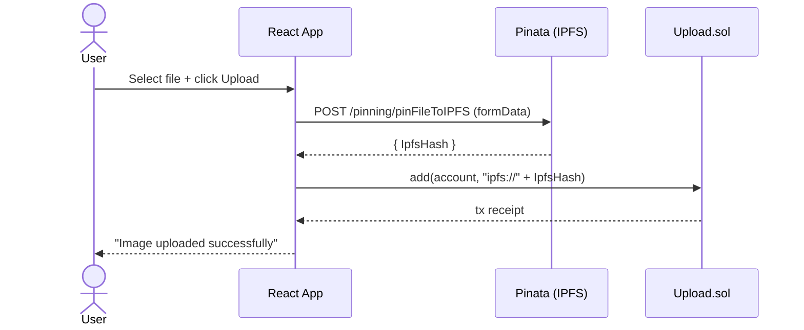

# BlockDrive — Decentralized Image Drive (Ethereum + IPFS)

BlockDrive is a simple, full‑stack DApp that lets you:
- Upload images to IPFS (via Pinata)
- Persist IPFS URIs on-chain
- View your uploaded images
- Share and revoke viewing access with other wallet addresses

It combines a Solidity smart contract (Hardhat), a React front‑end (ethers v6), and IPFS storage.

---

## Tech Stack

- Smart contracts: Solidity `^0.8.9`
- Framework: Hardhat (`@nomicfoundation/hardhat-toolbox`)
- Frontend: React (Create React App)
- Web3: `ethers` v6 (frontend)
- Storage: IPFS via Pinata pinning API
- Styling: Plain CSS

---

## Project Structure

```
contracts/Upload.sol         # Core access-controlled image registry (URIs per owner)
scripts/deploy.js            # Hardhat deploy script
hardhat.config.js            # Hardhat config; artifacts => client/src/artifacts
client/src/App.js            # App entry, contract wiring, layout
client/src/components/       # FileUpload, Display, Modal components + CSS
client/src/artifacts/        # ABI/artifacts generated by Hardhat
```

---

## How It Works

Smart contract (Upload.sol):
- `add(address _user, string uri)`: Append an IPFS URI to `_user`’s image list.
- `allow(address user)`: Grant `user` permission to view your list.
- `disallow(address user)`: Revoke that permission.
- `display(address user) view`: Return `user`’s URIs if caller is the owner or has been allowed.
- `shareAccess() view`: Return the caller’s access list snapshot.

Frontend:
- Uploads files to Pinata using `pinFileToIPFS` then calls `add(account, "ipfs://<CID>")`.
- Displays images using Pinata’s public gateway `https://gateway.pinata.cloud/ipfs/<CID>`.
- Lets the owner share access (and revoke) through the modal UI.

Important: IPFS is public by design. “Access control” here lives in the smart contract and UI. Anyone with a CID (hash) can fetch the content from IPFS. For private data, add client‑side encryption before pinning, and manage keys off‑chain.

---

## Flowcharts

Upload Flow



Display Flow

```mermaid
flowchart TD
  A[Enter address or use own] --> B[contract.display(address)]
  B --> C{Owner or Allowed?}
  C -- No --> E[Revert: "you don't have access"]
  C -- Yes --> D[Return string[] of ipfs:// URIs]
  D --> F[Render via Pinata gateway]
```

Share / Revoke Flow

```mermaid
flowchart TD
  O[Owner] -->|allow(other)| SC[Upload.sol]
  SC --> L[accessList updated]
  Other -->|display(owner)| SC
  SC -->|if allowed| V[Return URIs]
  O -->|disallow(other)| SC
  SC --> R[Permission removed]
```

---

## Quick Start (Local)

Prerequisites
- Node.js 18+
- MetaMask browser extension
- Pinata account and API keys (for IPFS pinning)

1) Install dependencies

```bash
# In project root (Hardhat)
npm install

# In frontend
cd client
npm install
```

2) Start a local Hardhat network

```bash
npx hardhat node
```

3) Deploy the contract to localhost

```bash
npx hardhat run scripts/deploy.js --network localhost
```

The deploy script prints the contract address. By default, the UI uses Hardhat’s first local deploy address:
`0x5FbDB2315678afecb367f032d93F642f64180aa3`. If your address differs, update it in:
`client/src/App.js` (variable `contractAddress`).

4) Configure MetaMask for localhost
- Network name: Localhost 8545
- RPC URL: http://127.0.0.1:8545
- Chain ID: 1337
- Currency symbol: ETH
- (Optional) Import one of Hardhat’s generated private keys for test accounts.

5) Start the frontend

```bash
cd client
npm start
```

---

## Commands Reference

Hardhat
- Compile: `npx hardhat compile`
- Test: `npx hardhat test`
- Local chain: `npx hardhat node`
- Deploy (localhost): `npx hardhat run scripts/deploy.js --network localhost`

Frontend
- Start dev server: `cd client && npm start`
- Build production: `cd client && npm run build`

---

## Configuration

Pinata Keys
- Current demo code uses inline API keys in `client/src/components/FileUpload.js`.
- Replace these with your own keys before use.
- Recommended: move secrets to environment variables (CRA picks up `REACT_APP_*`). Example:

```bash
# client/.env (do not commit!)
REACT_APP_PINATA_API_KEY=...
REACT_APP_PINATA_SECRET_API_KEY=...
REACT_APP_PINATA_GATEWAY=https://gateway.pinata.cloud/ipfs/
```

Then update `FileUpload.js` to read from `process.env`.

Contract Address
- If you redeploy, update `contractAddress` in `client/src/App.js`.

Gateways
- The UI rewrites `ipfs://<CID>` to `https://gateway.pinata.cloud/ipfs/<CID>` for display.
- You can swap gateways (e.g. Cloudflare, ipfs.io) if desired.

---

## Smart Contract API (Upload.sol)

```solidity
function add(address _user, string memory url) external
```
Append an IPFS URI to `_user`’s list. Frontend passes the caller’s address.

```solidity
function allow(address user) external
```
Grant `user` permission to call `display(msg.sender)`.

```solidity
function disallow(address user) external
```
Revoke a previously granted permission.

```solidity
function display(address _user) external view returns (string[] memory)
```
Return `_user`’s URIs if caller is `_user` or has been allowed by `_user`.

```solidity
function shareAccess() public view returns (Access[] memory)
```
Return the caller’s access list entries.

---

## Security Notes and Limitations

- IPFS CIDs are public; contract access control only gates the app’s read path.
- For real privacy, encrypt files client‑side and store encrypted blobs on IPFS; share decryption keys off‑chain.
- API keys must not be committed; use `.env` and avoid exposing them in client code. Consider a lightweight backend to sign pin requests.
- The list grows unbounded; add pagination or limits for production.

---

## Troubleshooting

- Blank UI / errors fetching images
  - Ensure the contract is deployed to the network MetaMask is connected to.
  - Verify `contractAddress` in `client/src/App.js` matches your deploy.
  - Restart `npx hardhat node` and redeploy if you restarted the chain.

- "you don't have access"
  - You’re requesting another user’s gallery without permission. Ask the owner to `allow()` your address.

- Pinata upload fails
  - Replace demo keys with your own. Check quota and CORS settings.

---

## Roadmap Ideas

- Client‑side encryption + key sharing
- Per‑file access control and revocation
- Events + TheGraph indexing for faster reads
- Drag‑and‑drop uploads and progress UI
- Multi‑gateway fallback for image rendering

---

## License

GPL‑3.0 (contract SPDX). Replace or update as needed for your use case.

